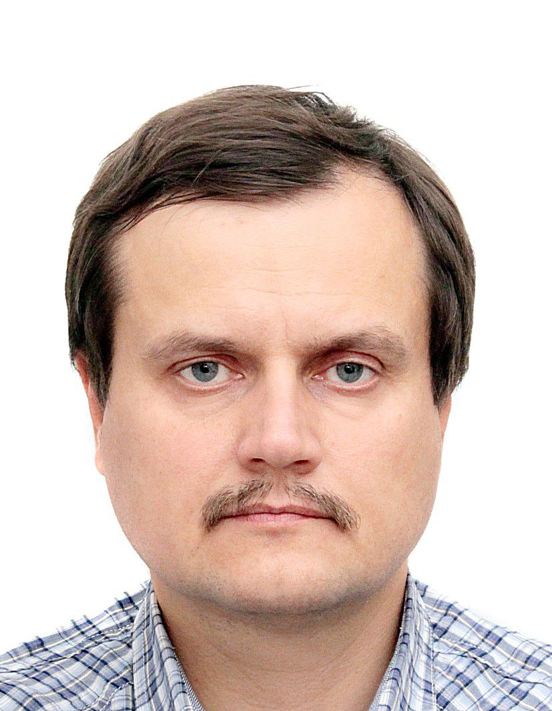

# Федосеев Николай

Учусь на курсах С++ и DevOps инженер в НЕТОЛОГИИ!
Цель обучения - полностью сменить направление и профиль деятельности в стороноу ИТ (программирование С++).

Vои более подробные данные о предыдущем опыте на сайте hh.ru. 
Ссылка на моё резюме https://hh.ru/resume/064d3867ff054493800039ed1f69477534706b

# Контакты:
1. тел.: 89055774715
2. e_mail: nfedoseev@gmail.com
